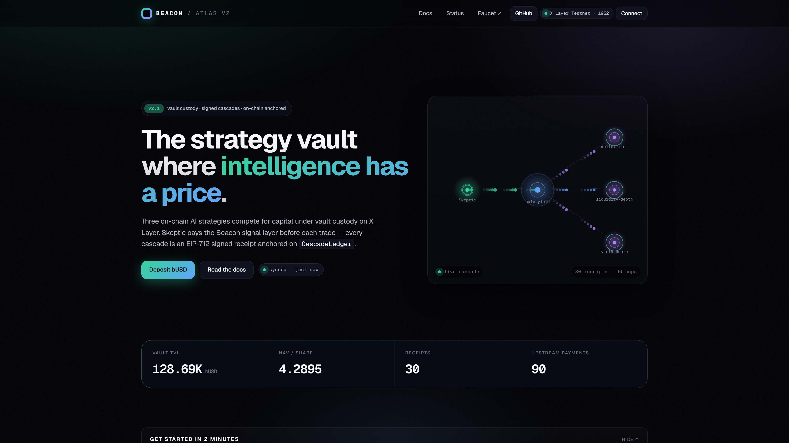
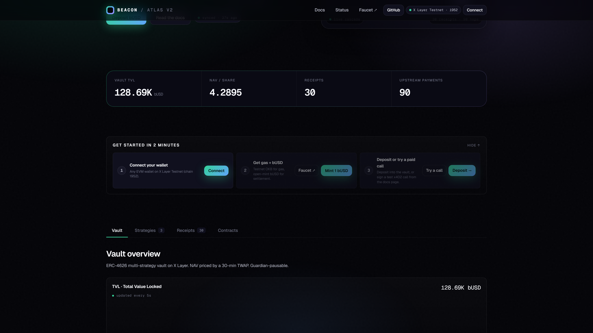
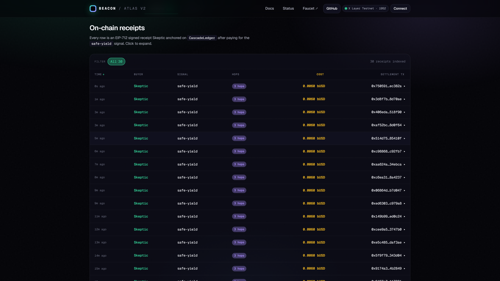
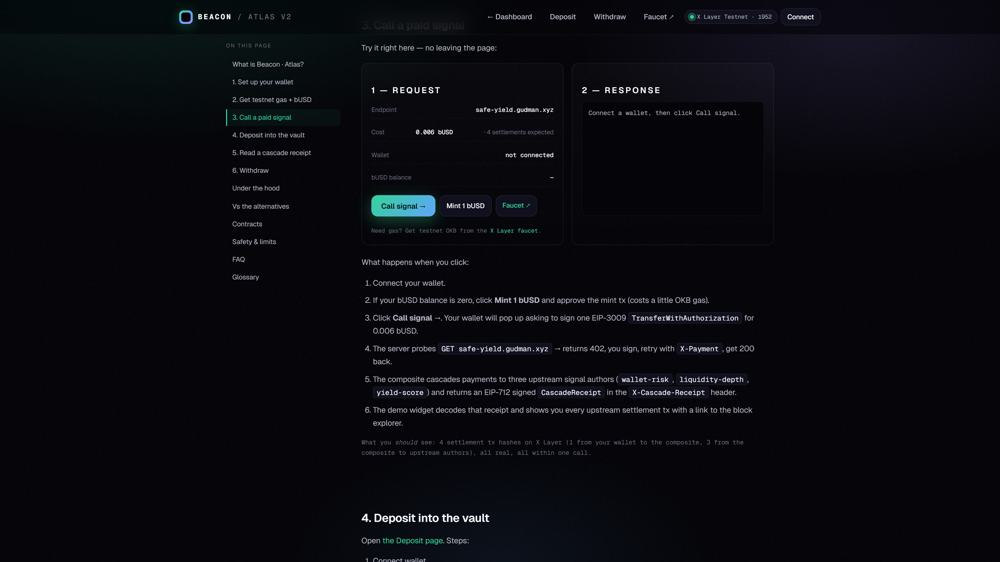
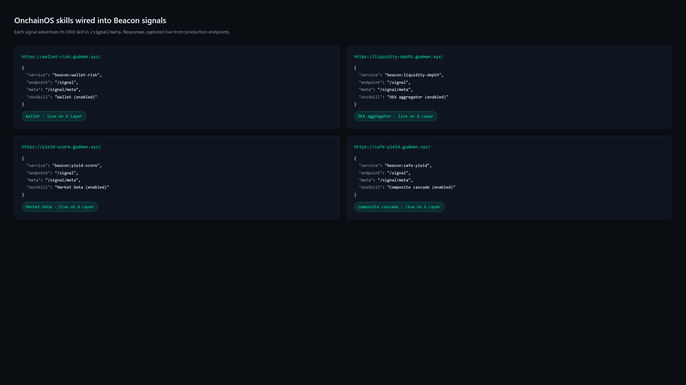

<div align="center">

# Beacon · Atlas V2

**Composable x402 payments for the agent economy on X Layer.**

One HTTP call → four on-chain settlements → one EIP-712 signed cascade receipt.

[](https://beacon.gudman.xyz)
[](https://beacon.gudman.xyz/docs.html)
[](https://www.oklink.com/xlayer)
[](https://beacon.gudman.xyz)
[](LICENSE)

[**Live demo**](https://beacon.gudman.xyz) · [**Docs**](https://beacon.gudman.xyz/docs.html) · [**MCP server**](https://mcp.gudman.xyz/sse) · [**X Layer testnet**](https://www.oklink.com/xlayer-test/address/0x02D1f2324D9D7323CB27FC504b846e9CB2020433)



</div>

---

## What is Beacon?

Beacon is a marketplace for **paid agent intelligence** on X Layer. Every HTTP call is settled via x402 (HTTP 402 + EIP-3009), and **composite signals cascade their payment to upstream authors** on every invocation — enforced cryptographically by an EIP-712 `CascadeReceipt` anchored on-chain.

The reference consumer is **Atlas V2**, a zero-custody multi-strategy vault where one of three AI strategies (Skeptic) buys the `safe-yield` signal before every trade. Every Skeptic tick produces **five real on-chain transactions** in seconds.

> **Built for the [OKX Build X Hackathon](https://beacon.gudman.xyz):**
> - **X Layer Arena** → Atlas V2 (full-stack dapp)
> - **Skills Arena** → `@beacon/sdk` (reusable SDK)

---

## Screenshots

| Landing | Cascade Receipt |
|---|---|
|  |  |

| Live x402 demo | OnchainOS integrations |
|---|---|
|  |  |

---

## Why it's different

Most "agent marketplaces" prove the primitive and stop. Beacon + Atlas compose into **one working product**:

1. **Real x402 on X Layer.** Coinbase's v1 SDK hardcodes a network enum that excludes X Layer. We built a spec-compliant server on `@x402/evm` v2 primitives with EIP-3009 settlement on USDT0.
2. **Composite cascades.** One call to `safe-yield` produces **four on-chain settlements**: buyer → composite, then composite → wallet-risk, liquidity-depth, yield-score. Fan-out is structurally enforced; upstream authors cannot be stiffed.
3. **Cryptographic receipts.** Every composite response carries an EIP-712 signed `CascadeReceipt` in the `X-Cascade-Receipt` header. The buyer verifies the signature; optional on-chain anchoring via `CascadeLedger` makes the entire payment graph queryable as events.
4. **Zero-custody vault.** NAV counts only vault idle + registered strategy equity. Each strategy owns a deterministic CREATE2 `SubWallet` only the strategy contract can move. Executors submit signed TradeIntents — no P&L manipulation.
5. **2,073+ on-chain CallRecorded events** on testnet, evenly distributed across 4 signals. Author-gated with nonce dedup — the count is not inflatable.

---

## How it works

One Skeptic tick, start to finish:

```
┌────────────┐   HTTP GET /signal              ┌──────────────────────┐
│  Skeptic   │ ──────────────────────────────> │  safe-yield          │
│ executor   │ <── HTTP 402 Payment Required ─ │  composite server    │
└─────┬──────┘                                 └──────────────────────┘
      │  sign EIP-3009 transferWithAuthorization
      │
      │  retry with X-Payment header
      ▼
┌────────────────────────────────────────────────────────────────────┐
│  safe-yield server                                                 │
│    1. settle buyer payment on-chain  (Skeptic → composite)         │
│    2. fetchWithPayment → wallet-risk upstream                      │
│    3. fetchWithPayment → liquidity-depth upstream                  │
│    4. fetchWithPayment → yield-score upstream                      │
│    5. sign EIP-712 CascadeReceipt binding all 4 settlements        │
│    6. return 200 + data + X-Cascade-Receipt header                 │
└─────┬──────────────────────────────────────────────────────────────┘
      │
      ▼
┌────────────┐   CascadeLedger.anchorReceipt()
│  Skeptic   │ ─────────────────────────────────> emits CascadeSettled
│ executor   │                                    + 3× UpstreamPaid
└────────────┘
      │
      ▼  strategy.submitAction(swapCalldata) — executes trade via OKX aggregator
```

**Five X Layer transactions per Skeptic tick.** Every number in the dashboard comes from a contract call, no off-chain accounting.

---

## OnchainOS + Uniswap integrations

| Skill | Endpoint | Where it's used |
|---|---|---|
| **DEX Aggregator Quote** | `/api/v5/dex/aggregator/quote` | `liquidity-depth` signal pipes OKX aggregator routes alongside raw Uniswap v3 pool math |
| **Market Data — Price** | `/api/v5/dex/market/price` | `yield-score` signal enriches APY with USD spot price |
| **Market Data — Candles** | `/api/v5/dex/market/candles` | `yield-score` computes market-regime context from 4×1H candles |
| **Wallet — Portfolio Value** | `/api/v5/wallet/asset/total-value` | `wallet-risk` adds high-value risk factor when portfolio > $100K |
| **Onchain Gateway — Simulate Tx** | `/api/v5/dex/aggregator/onchain-gateway/simulate-tx` | Pre-flight check before strategy tx submission |
| **Onchain Gateway — Gas Price** | `/api/v5/dex/aggregator/onchain-gateway/gas-price` | Agent-runner reads current X Layer gas before submitting |
| **Uniswap v3 pool math** | `factory.getPool` / `slot0` / `liquidity` | `liquidity-depth` reads live pool state via viem |

All OnchainOS calls are HMAC-SHA256 signed (`OK-ACCESS-KEY` / `OK-ACCESS-SIGN` / `OK-ACCESS-TIMESTAMP` / `OK-ACCESS-PASSPHRASE`). Shared client: [`packages/okx-client/src/index.ts`](packages/okx-client/src/index.ts).

---

## Deployments

### X Layer mainnet (chainId 196)

| Contract | Address |
|---|---|
| `AtlasVaultV2` | [`0xe5A5A31145dc44EB3BD701897cd825b2443A6B76`](https://www.oklink.com/xlayer/address/0xe5A5A31145dc44EB3BD701897cd825b2443A6B76) |
| `AggregatorStrategy (Fear)` | [`0xa551c999d72724eA7d94abc5D803ED030A836273`](https://www.oklink.com/xlayer/address/0xa551c999d72724eA7d94abc5D803ED030A836273) |
| `AggregatorStrategy (Greed)` | [`0x67B211A37422A245c04688A7aa17Db9a2836CfE2`](https://www.oklink.com/xlayer/address/0x67B211A37422A245c04688A7aa17Db9a2836CfE2) |
| `AggregatorStrategy (Skeptic)` | [`0x80ff5aCFb497FdD1EB0944847f2F0f3914683C38`](https://www.oklink.com/xlayer/address/0x80ff5aCFb497FdD1EB0944847f2F0f3914683C38) |
| `CascadeLedger` | [`0x10942C0EAD5346031ED0d8736f6Ab4a73d8c43f1`](https://www.oklink.com/xlayer/address/0x10942C0EAD5346031ED0d8736f6Ab4a73d8c43f1) |
| `SlashingRegistry` | [`0xBa6b5d940BAd7581463f4b2607131d0C8DcE22f1`](https://www.oklink.com/xlayer/address/0xBa6b5d940BAd7581463f4b2607131d0C8DcE22f1) |
| `WithdrawQueue` | [`0x5d1885aF211Bde60f2ca0833921B51E572193016`](https://www.oklink.com/xlayer/address/0x5d1885aF211Bde60f2ca0833921B51E572193016) |
| `TwapOracle` | [`0xaD5FE8f63143Fae56D097685ECF99BEEc612169a`](https://www.oklink.com/xlayer/address/0xaD5FE8f63143Fae56D097685ECF99BEEc612169a) |
| **USDT** (settlement token) | [`0x779ded0c9e1022225f8e0630b35a9b54be713736`](https://www.oklink.com/xlayer/address/0x779ded0c9e1022225f8e0630b35a9b54be713736) |
| **WOKB** (volatile token) | [`0xe538905cf8410324e03a5a23c1c177a474d59b2b`](https://www.oklink.com/xlayer/address/0xe538905cf8410324e03a5a23c1c177a474d59b2b) |
| **OKX DEX Router** | [`0x8b773D83bc66Be128c60e07E17C8901f7a64F000`](https://www.oklink.com/xlayer/address/0x8b773D83bc66Be128c60e07E17C8901f7a64F000) |

### X Layer testnet (chainId 1952) — sandbox

| Contract | Address |
|---|---|
| `AtlasVaultV2` | [`0xC968616eB00B80a8A72E9335b739223E212cb4F5`](https://www.oklink.com/xlayer-test/address/0xC968616eB00B80a8A72E9335b739223E212cb4F5) |
| `SignalRegistry` | [`0x02D1f2324D9D7323CB27FC504b846e9CB2020433`](https://www.oklink.com/xlayer-test/address/0x02D1f2324D9D7323CB27FC504b846e9CB2020433) |
| `CascadeLedger` | [`0x270Bb62a10b4eEbF5e851ef826ff38b6a2A8ee8A`](https://www.oklink.com/xlayer-test/address/0x270Bb62a10b4eEbF5e851ef826ff38b6a2A8ee8A) |
| `PaymentSplitter` | [`0xaD5FE8f63143Fae56D097685ECF99BEEc612169a`](https://www.oklink.com/xlayer-test/address/0xaD5FE8f63143Fae56D097685ECF99BEEc612169a) |
| `bUSD` (EIP-3009 test token) | [`0xe5A5A31145dc44EB3BD701897cd825b2443A6B76`](https://www.oklink.com/xlayer-test/address/0xe5A5A31145dc44EB3BD701897cd825b2443A6B76) |

### Live endpoints

| Host | Role |
|---|---|
| `beacon.gudman.xyz` | Dashboard + deposit UI |
| `wallet-risk.gudman.xyz/signal` | Base signal — wallet risk scoring |
| `liquidity-depth.gudman.xyz/signal` | Base signal — Uniswap v3 pool reads |
| `yield-score.gudman.xyz/signal` | Base signal — lending APY aggregator |
| `safe-yield.gudman.xyz/signal` | **Composite** — signs `CascadeReceipt` |
| `mcp.gudman.xyz/sse` | MCP server (Claude / Cursor / any MCP client) |

### Project on-chain identity

| Role | X Layer address | Responsibility |
|---|---|---|
| Atlas deployer | `0x90329b94b178b45B4a9f25cfCF3979a2aea41542` | Deploys, seeds vault, harvests, emergency pause |
| Fear executor | `0x4fc3a3848fFc74f1B608A3961D27F07e4216ae4F` | Submits momentum-strategy intents |
| Greed executor | `0x411C0Ec26BE4628e79090f4e35f9D45079767785` | Submits mean-revert intents |
| **Skeptic executor (agentic wallet)** | `0x94f94a111cBBd5e33ec440A199542955a307bB8e` | Pays for signals, anchors receipts, trades |
| `wallet-risk` author | `0x1e9921B1c6ca20511d9Fc1ADb344882c59002bD6` | Signal payee |
| `liquidity-depth` author | `0x75D51494005Aa71e0170DCE8086d7CaEC07B7906` | Signal payee |
| `yield-score` author | `0x20C7Ad3561993FA5777bFF6cd532697d1ca994b0` | Signal payee |
| `safe-yield` composite | `0x7535ab44553FE7D0B11aa6ac8CBc432c81Cb998D` | Composite signer + cascade payee |

---

## Architecture

```
beacon/
├── packages/
│   ├── sdk/                        # @beacon/sdk — defineSignal, defineComposite, fetchWithPayment
│   │   ├── receipt.ts              # CascadeReceipt EIP-712 sign / verify
│   │   ├── composite.ts            # middleware-based receipt signing
│   │   ├── signal.ts               # preRoute hook — 402 → pay → 200
│   │   ├── client.ts               # fetchWithPayment
│   │   └── eip3009.ts              # transferWithAuthorization primitives
│   ├── mcp/                        # @beacon/mcp — stdio + SSE MCP server
│   └── okx-client/                 # HMAC-SHA256 OnchainOS client
├── contracts/
│   ├── atlas/
│   │   ├── AtlasVaultV2.sol        # ERC-4626 + Pausable + keeper harvest
│   │   ├── StrategyBase.sol        # vault-gated capital flows
│   │   ├── SubWallet.sol           # strategy-owned custody (zero EOA surface)
│   │   ├── TwapOracle.sol          # ring-buffer TWAP — closes flash-loan NAV vuln
│   │   ├── SlashingRegistry.sol    # stake + challenge window + fraud proof
│   │   └── WithdrawQueue.sol       # ERC-7540-inspired async redemption
│   ├── CascadeLedger.sol           # EIP-712 receipt registry
│   ├── SignalRegistry.sol          # on-chain signal directory
│   ├── PaymentSplitter.sol         # pull-based royalty distribution
│   └── TestToken.sol               # bUSD (EIP-3009)
├── signals/
│   ├── wallet-risk/                # OnchainOS Wallet skill
│   ├── liquidity-depth/            # Uniswap v3 + OnchainOS DEX aggregator
│   ├── yield-score/                # OnchainOS Market Data skill
│   └── safe-yield/                 # composite — signs CascadeReceipts
├── atlas/agent-runner/             # Fear, Greed, Skeptic, MarketMover
├── app/                            # Vite dashboard (beacon.gudman.xyz)
├── subgraph/                       # The Graph subgraph
└── deploy/                         # systemd + nginx + VPS scripts
```

---

## Quickstart

Prereqs: Node 20+, Git, an X Layer testnet EOA with ~0.5 OKB ([faucet](https://www.okx.com/xlayer/faucet)).

```bash
git clone https://github.com/Ridwannurudeen/beacon
cd beacon && npm install

# Run the test suite (42/42 passing)
cd contracts && npm run test

# Build the SDK
cd ../packages/sdk && npm run build

# Run the dashboard locally
cd ../../app && npm run dev
```

Full deploy walkthrough in [`docs/DEPLOYMENT_VPS.md`](docs/DEPLOYMENT_VPS.md).

---

## Using `@beacon/sdk`

```ts
import { defineSignal, defineComposite, fetchWithPayment } from "@beacon/sdk";

// Publish a paid signal in 15 lines
const signal = defineSignal({
  slug: "my-signal",
  price: 1500n,                  // 0.0015 USDT per call
  payTo: account.address,
  token: usdtDescriptor,
  chainId: 196,                  // X Layer mainnet
  settlementWallet,
  handler: async (ctx) => ({ score: 88 }),
});

// Cascade payments to upstream authors
const composite = defineComposite({
  slug: "safe-yield",
  upstream: [
    { slug: "wallet-risk", url: "...", shareBps: 3300 },
    { slug: "liquidity-depth", url: "...", shareBps: 3300 },
    { slug: "yield-score", url: "...", shareBps: 3400 },
  ],
  handler: async (ctx, upstream) => compose(upstream),
});
// Composite returns the signed CascadeReceipt automatically.

// Client side
const res = await fetchWithPayment(url, walletClient);
// Returns decoded X-Payment-Response (settlement tx) + X-Cascade-Receipt
```

---

## Tests, CI & security

- **42/42 Hardhat tests** — includes a 10-case adversarial suite covering NAV inflation, sub-wallet custody breach, P&L manipulation, fraud claims, over-withdraw
- **Foundry invariants** (`test/foundry/AtlasInvariants.t.sol`) — NAV/share consistency under random op sequences
- **Slither** — clean of high/medium findings
- **GitHub Actions CI** — tests + Slither + build on every PR
- **TWAP oracle** closes the flash-loan NAV manipulation vector
- **Pausable** with separate `guardian` (fast-trigger) and `admin` (timelock-target) roles
- **Reentrancy-guarded** deposit / withdraw / allocate / harvest / emergency revoke
- **SafeERC20** + OpenZeppelin 5.0.2 (pinned pre-`mcopy`)

Not yet: professional audit, multi-sig governance, Chainlink-grade price feeds, insurance fund.

---

## Hackathon tracks

### X Layer Arena — **Atlas V2**

| Prize | How we claim it |
|---|---|
| **Best x402 application** | Skeptic's per-trade signal cascade — signed and anchored on-chain via `CascadeLedger` |
| **Best economy loop** | Vault → allocation → strategy → sub-wallet → signal spend → harvest → reallocation |
| **Best MCP integration** | `@beacon/mcp` exposes 6 tools + 2 resources to any MCP-capable agent client |
| **Most active agent** | 2,073+ CallRecorded events on testnet, evenly distributed across 4 signals |

### Skills Arena — **@beacon/sdk**

| Prize | How we claim it |
|---|---|
| **Best data analyst** | `liquidity-depth` reads Uniswap v3 pool math **plus** pipes an OKX aggregator quote |
| **Best Uniswap integration** | Direct pool `slot0` reads + OKX DEX aggregator routing |
| **Most innovative** | `CascadeReceipt` as a novel EIP-712 primitive for provable upstream royalty flow |

---

## Environment

```bash
# contracts/.env
PRIVATE_KEY=0x...                  # X Layer deployer EOA
XLAYER_RPC_URL=https://rpc.xlayer.tech
XLAYER_TESTNET_RPC_URL=https://testrpc.xlayer.tech

# signals/*/env — real OnchainOS calls (mainnet)
ONCHAINOS_API_KEY=...
ONCHAINOS_SECRET_KEY=...
ONCHAINOS_PASSPHRASE=...
OKX_BASE_URL=https://web3.okx.com

# signals/*/env — signal-author config
SIGNAL_PRIVATE_KEY=0x...
PAY_TO=0x...
TOKEN_ADDRESS=0x...                # USDT on mainnet; bUSD on testnet
CHAIN_ID=196                       # or 1952 for testnet
```

---

## Docs

- [`docs/DEMO_SCRIPT.md`](docs/DEMO_SCRIPT.md) — 2-minute demo video script
- [`docs/DEPLOYMENT_VPS.md`](docs/DEPLOYMENT_VPS.md) — full VPS deploy walkthrough
- [`docs/QUICKSTART.md`](docs/QUICKSTART.md) — local dev setup
- [`docs/SUBMISSIONS.md`](docs/SUBMISSIONS.md) — hackathon submission details
- [`docs/images/README.md`](docs/images/README.md) — screenshot capture guide

---

## Team

Solo builder. **X:** [@ridnurudeen](https://x.com/ridnurudeen).

Previous work: ShieldBot (BNB Chain security), HERMES (NousResearch), Nansen Divergence (Nansen CLI Hackathon), GenLayer Bradbury Builders.

## License

MIT — see [LICENSE](LICENSE).
